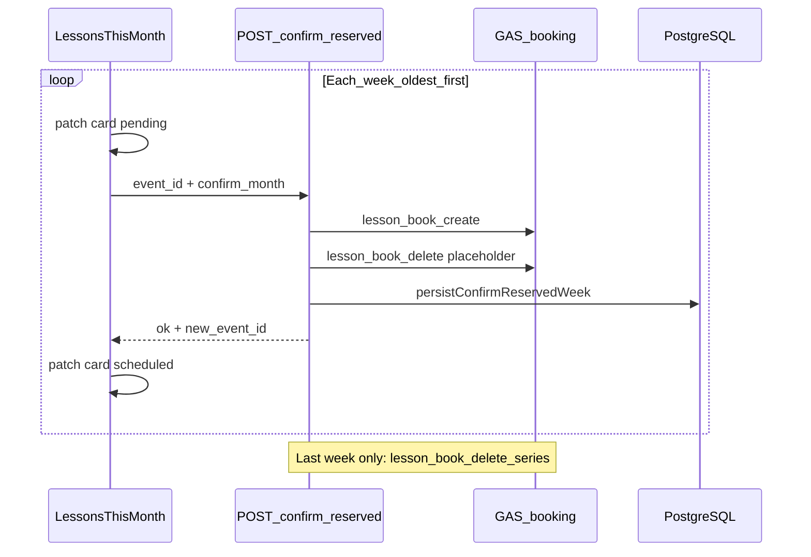

# Weekly Confirm Schedule — implementation reference

**Status:** Working as of commit `1b72d64` (May 2026).  
**Purpose:** Preserve the exact algorithm and invariants so a future refactor does not regress to the old bulk flow or break Calendar deletes.

---

## What this feature does

Staff confirm a **full month** of **reserved** (yellow placeholder) lessons from the student schedule UI. Each week is processed **one API call at a time** (oldest first). For each week:

1. Create a real green single Calendar lesson (`lesson_book_create`).
2. Delete **only that week’s** yellow placeholder (`lesson_book_delete`).
3. Update DB: `reserved` → `scheduled` with new `event_id`.
4. After the **last** week in the month, delete the empty recurring series shell once (`lesson_book_delete_series`).

**No** next-month recurring reserved hold is created (removed from the old bulk design).

---

## Why weekly (not bulk)

The previous bulk flow caused real bugs:

| Old bulk behavior | Problem |
|-------------------|---------|
| Create **all** weeks, then delete **all** placeholders | Green lesson 1/4 and yellow placeholder share the same slot; slot sweep / series delete could remove the new lesson |
| Delete series master mid-month | Wiped remaining weeks’ placeholders before their turn |
| Create next-month recurring hold on confirm | Unwanted yellow series in the following month |
| One DB transaction at the end | All-or-nothing; hard to show per-week progress |

Weekly confirm fixes this by scoping Calendar mutations to **one occurrence** and protecting the just-created event with `excludeEventIds`.

---

## End-to-end flow

---

## Client (`LessonsThisMonth.jsx`)

**Entry:** Confirm schedule in `LessonDetailsModal` → `handleConfirmSchedule`.

**Batch discovery:** `listReservedBatchEventIds(monthData, monthKey, anchorLesson)`

- Same recurring hold as anchor: strip `event_id` to base (`stripMonthlyEventIdBase`), keep rows with `status === 'reserved'`.
- Sort by `day` then `time` (oldest first).
- One entry per distinct `event_id` (group lessons share one `event_id` per slot).

**Loop (per `eventID`):**

1. Optimistic patch: `calendarSyncStatus: 'pending'`.
2. `POST /api/schedule/confirm-reserved` with `{ event_id, confirm_month, pack_total? }`.
3. On success: patch `status: 'scheduled'`, `calendarSyncStatus: 'synced'`.
4. On failure: patch failed for that week, **break** loop (earlier weeks stay scheduled).
5. `refetchSilent()` once at end.

**Do not** mark the whole batch pending up front; only the current week shows Pending.

---

## Server (`POST /schedule/confirm-reserved`)

**One week per request.** Body: `event_id` (that week’s row), optional `confirm_month`, optional `pack_total`.

### Batch scope (for overlap + numbering)

All `reserved` rows in `confirm_month` sharing the same series as the anchor:

- `calendar_source_event_id` matches, **or**
- stripped `event_id` base matches.

Grouped by distinct `event_id`, sorted by `date` / `start` → `groupReservedBatchRows`.

### Per-request order (critical — do not reorder)

| Step | Action | On failure |
|------|--------|------------|
| 1 | Validate row (`reserved`, synced, `student_id`, not local-only) | 4xx |
| 2 | `assertBookableSlotForConfirm` (batch `event_id`s excluded from overlap) | 4xx |
| 3 | **`createBookedLessonEventInGas`** — green single event | 502, DB unchanged |
| 4 | **`deleteReservedPlaceholderForWeek`** — yellow placeholder only | Rollback create, 502, DB unchanged |
| 5 | **`persistConfirmReservedWeek`** — one transaction for that `event_id` | Rollback create, 500 |
| 6 | If no reserved weeks left in month → **`deleteReservedCalendarSeriesInGas`** | 502 (week already scheduled) |
| 7 | If last week → `deleteOrphanReservedRowsAfterConfirm` | — |

**Invariant:** Create **before** delete. Delete uses `excludeEventIds` from the new lesson so slot sweep cannot remove the green event.

### Key helpers (`server/routes/schedule.js`)

| Helper | Role |
|--------|------|
| `groupReservedBatchRows` | Distinct `event_id` groups, sorted by date/start |
| `deleteReservedPlaceholderForWeek` | GAS delete for one week’s placeholder |
| `persistConfirmReservedWeek` | `reserved` → `scheduled` + reschedules FK rewrite for that old `event_id` |
| `countReservedWeeksInBatch` | Drives series cleanup after last week |
| `collectExcludeCalendarEventIds` | IDs that must not be deleted (new GAS id + new monthly id + bare forms) |
| `bareSeriesMasterFromScheduleRow` | Series master id for instance lookup |
| `rollbackConfirmCreatedLessons` | Delete newly created GAS event on failure |

### Title `n/total`

`lessonNumber = baseLessonCount + weekIndexInBatch` where `baseLessonCount` counts other non-cancelled lessons in the month excluding the batch’s reserved `event_id`s.

---

## Placeholder delete (`deleteReservedPlaceholderForWeek`)

Calls `deleteBookedLessonEventInGas` with:

| Flag | Value | Why |
|------|-------|-----|
| `seriesMasterId` | from `bareSeriesMasterFromScheduleRow` | Instance lookup on recurring series |
| `skipSlotSweep` | `false` | Slot sweep finds yellow holds at same time |
| `skipSeriesMasterIdInDirectRemove` | `true` | Do **not** remove whole series mid-month |
| `strictDelete` | `true` | “Event not found” is **not** success (server `normalizeDeleteResult`) |
| `confirmReservedPlaceholder` | `true` | GAS: broader reserved-hold matching |
| `excludeEventIds` | from `collectExcludeCalendarEventIds([newGasId], [plannedItem])` | Protect green lesson |

Passes `occurrenceStartIso`, `calendarSourceEventId`, `studentId`, `endIso` via `calendarGasOptions(groupRows)`.

---

## GAS (`calendarAPI/Code.js`)

**Revision marker:** `BOOKING_SCRIPT_REVISION = '2026-05-21-confirm-week-placeholder'`  
Check deployed script via `[gas:...]` in API errors or `gas_revision` in responses.

### `lesson_book_delete` pipeline (`lessonBookExecuteDelete_`)

1. Direct `Events.remove` on candidate ids (`lessonBookCollectDeleteIds_`).
2. `tryFindInstanceIdOnCalendarForDelete_` — list expanded instances near `occurrenceStartIso`, match `seriesMasterId`.
3. Slot sweep (`lessonBookDeleteAllAtSlotOnCalendar_`) unless `skipSlotSweep: true`.
4. Series master remove only if `skipSeriesMasterIdInDirectRemove` is **false** and nothing deleted yet.

### Confirm-specific GAS rules

- **`excludeEventIds`:** `lessonBookBuildExcludeSet_` normalizes `id` and `id` without `@google.com` so green and yellow id formats don’t confuse exclusion.
- **`skipSeriesMasterIdInDirectRemove`:** Do not push bare `calendarSourceEventId` when it is the series master (avoid deleting entire series during week step).
- **`confirmReservedPlaceholder`:** Slot sweep also matches reserved holds by description/summary/`colorId === 5` (Banana).

### Actions used

- `lesson_book_create` — green Basil (`colorId` 10) regular lessons
- `lesson_book_delete` — per-week placeholder
- `lesson_book_delete_series` — empty shell after last reserved week in month

**Deploy:** `clasp push` + new Web App version in Apps Script (pushing code alone does not update the live `/exec` URL).

---

## API response fields (debugging)

Successful week response includes:

- `new_event_id` — DB monthly disambiguated id
- `created_calendar_id` / `created_calendar_event_id`
- `deleted_calendar_id` / `deleted_calendar_event_id` / `deleted_count`
- `series_cleaned_up` — true on last week when series master removed
- `week_index` / `weeks_total` — position in **remaining** batch at request time (note: `week_index` resets as weeks are confirmed)

Verify: `created_calendar_event_id` ≠ `deleted_calendar_event_id` when delete succeeded.

---

## What NOT to revert

1. **Bulk create-all → delete-all** in one confirm request.
2. **Delete placeholder before create** (leaves slot empty or blocks create; was a regression).
3. **`deleteReservedCalendarSeriesInGas` during each week** (kills other weeks’ placeholders).
4. **Next-month `createReservedRecurringHoldInGas`** on confirm.
5. **Treating GAS “not found” as success** for confirm placeholder deletes (`strictDelete: true`).
6. **Slot sweep without `excludeEventIds`** after create (removed lesson 1/4 in old bulk flow).
7. **Removing `confirmReservedPlaceholder` / id normalization in GAS** (placeholders stop deleting when Calendar id formats differ).

---

## File map

| Layer | Path |
|-------|------|
| API route | `server/routes/schedule.js` — `POST /confirm-reserved` |
| GAS wrappers | `server/lib/bookingCalendarSync.js` — `createBookedLessonEventInGas`, `deleteBookedLessonEventInGas`, `strictDelete` |
| Event id resolution | `server/lib/calendarEventId.js` — `gasCalendarEventIdFromMonthly`, instance suffix |
| UI loop | `client/src/components/LessonsThisMonth.jsx` — `handleConfirmSchedule`, `listReservedBatchEventIds` |
| API client | `client/src/api.js` — `confirmReservedSchedule` |
| GAS | `calendarAPI/Code.js` — `lesson_book_*`, `lessonBookExecuteDelete_` |
| User docs | `docs/schedule-booking.md` — Confirm Schedule section |

---

## Quick test checklist

1. Month with 3+ reserved weeks: cards go Pending → Scheduled **one at a time**; Calendar shows green singles; yellow placeholders disappear week by week.
2. After week 1, weeks 2+ placeholders still visible until their API turn.
3. Failure on week 2: week 1 scheduled in Calendar/DB; week 2+ still reserved; clear error.
4. After last week: recurring series shell gone (`series_cleaned_up: true`); **no** new yellow series in next month.
5. Group lesson (same `event_id`, multiple students): one API call updates all rows for that slot.

---

## Related git commit

`1b72d64` — `feat(schedule): weekly confirm reserved without next-month hold`
