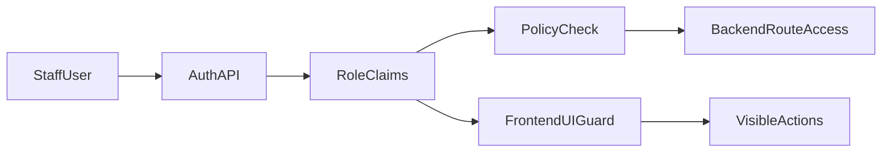

# RBAC Plan for Admin, Manager, Staff

## Goal

Move from the current `is_admin` model to role-based privileges with explicit workflows for staff management, delete approvals, and login via active staff records.

## Current Baseline (from code)

- Backend uses binary admin flag in [server/db/schema.sql](server/db/schema.sql) and [server/routes/auth.js](server/routes/auth.js).
- Frontend uses ad-hoc admin checks in [client/src/components/Navbar.jsx](client/src/components/Navbar.jsx) and [client/src/pages/Notifications.jsx](client/src/pages/Notifications.jsx).
- Most pages/routes are auth-only via [client/src/components/ProtectedRoute.jsx](client/src/components/ProtectedRoute.jsx) and server auth middleware.

## Permission Model (default)

- `admin`: full system access, including role management, undo/redo, security settings, system notifications, and approve-any delete requests.
- `manager`: all staff CRUD operations plus operational CRUD in normal modules; can approve delete requests; cannot manage role assignments.
- `staff`: normal operational actions, can request deletion (not execute direct destructive delete).

## Confirmed Decisions

- Google Calendar integration/data fetch is a main-priority item.
- Create Google Contacts for students on creation (sync student record to Google Contacts).
- Add staff lifecycle support with an `active` toggle/state.
- Login UI must fetch active staff members dynamically (no hardcoded button/list).
- Inactive staff should not appear in login dropdown.
- Migration should create only `Khacey` as initial admin; other staff are created from the app UI.
- Admin and Manager can perform all staff CRUD operations.
- New staff created via Add Staff button require only `name` on creation and default to `staff` role.
- Only `admin` can change roles after creation.
- Sensitive admin actions require reason + extra confirmation + audit logging.

## Implementation To-Do List

1. Main priority: connect to Google Calendar API or fetch calendar data.
   - Add backend integration endpoint/service for calendar event retrieval.
   - Define auth method for calendar access (service account or OAuth) and secure credentials handling.
   - Expose normalized calendar data to frontend for scheduling views.
2. Create Google Contact on student creation.
   - When a student is created, optionally create a corresponding contact in Google Contacts (People API).
   - Map student name, phone, email (if captured) to contact fields; consider toggle in UI or env to enable/disable.
   - Reuse or align Google API credentials with calendar integration where possible.
3. Define and approve a permission matrix by feature/action.
   - Students: read/create/update/delete
   - Payments/notes: read/create/update/delete
   - Notifications: create/edit/delete (own vs any, system notifications)
   - Change History: view/undo/redo (`admin` yes)
   - Staff management: create/read/update/deactivate (`admin` + `manager`), role updates (`admin` only)
   - Deletions: `staff` request only; `manager`/`admin` approve or reject
4. Add RBAC schema and migration path.
   - Extend [server/db/schema.sql](server/db/schema.sql) with role field(s) and `is_active`/`active` status on staff.
   - Add delete-request storage (requester, target entity snapshot, approver, decision, reason, timestamps).
   - Update [scripts/migrate.js](scripts/migrate.js) to create only `Khacey` as bootstrap admin.
5. Centralize backend authorization.
   - Add role/permission middleware in server middleware layer and apply per route.
   - Update [server/routes/auth.js](server/routes/auth.js) so login options and auth context use dynamic staff records rather than hardcoded identities.
   - Add staff CRUD endpoints with role enforcement (`admin`/`manager`), and role-change endpoint restricted to `admin`.
   - Enforce delete-request approval path (no direct delete for `staff`).
   - Enforce sensitive actions first (undo/redo in [server/routes/changeLog.js](server/routes/changeLog.js), security settings, system notifications).
6. Replace frontend ad-hoc checks with policy utilities.
   - Add a central permission helper in client context/state.
   - Update [client/src/components/ProtectedRoute.jsx](client/src/components/ProtectedRoute.jsx) for role-aware route guards.
   - Replace `isAdminUser` logic in [client/src/components/Navbar.jsx](client/src/components/Navbar.jsx) and [client/src/pages/Notifications.jsx](client/src/pages/Notifications.jsx).
   - Add Staff page controls: `Add Staff` button (name-only form), active toggle, role display/edit availability by role.
   - Update login UI to populate from active staff list endpoint.
   - Hide/disable disallowed actions in students/change-history/deletion flows.
7. Strengthen auditing for privileged actions.
   - Continue using [server/lib/changeLog.js](server/lib/changeLog.js) and include authorization context when practical.
   - Require clear tracking for role changes, undo/redo, and delete approval decisions.
   - Require reason + explicit confirmation UI for sensitive actions.
8. Verify with role-based test checklist.
   - API tests: each role vs each protected endpoint/action.
   - UI tests: navigation visibility, button/action visibility, blocked action behavior.
   - Login tests: only active staff appear in dropdown.
   - Workflow tests: staff submit delete request -> manager/admin approve/reject -> audit captured.
   - Regression checks for existing notification ownership rules.

## Suggested Rollout Order

- Phase 1: Google Calendar integration/data fetch (backend + normalized API contract)
- Phase 1b (or same phase): Google Contacts creation on student creation
- Phase 2: Backend schema + middleware + `/auth/me` role payload
- Phase 3: Staff lifecycle endpoints + delete approval workflow
- Phase 4: Frontend policy helper + Add Staff + active login dropdown
- Phase 5: Remove legacy `is_admin` checks and hardcoded name fallback
- Phase 6: Full role regression testing and docs update
- Later phase: Staff shift management (scheduling, assignment, and permissions)

## High-Level Flow

